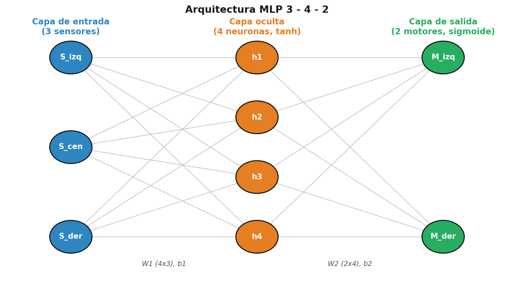

# U2A3 — MLP para robot TURTLE (seguidor de línea en Proteus)

Perceptrón multicapa (MLP) que controla un robot diferencial **TURTLE** en Proteus.
Lee 3 sensores de línea y genera 2 salidas PWM (un motor por lado). El Arduino solo
ejecuta la **propagación hacia adelante**; los pesos y bias se entrenaron en Python.

## Arquitectura
- Entrada: 3 neuronas (sensor izquierdo, central, derecho) — codificación 0/1
- Oculta: 4 neuronas, activación **tanh**
- Salida: 2 neuronas, activación **sigmoide** (0–1) → PWM 0–255
- Entrenamiento: descenso de gradiente, lr = 0.1, 20 000 épocas, seed = 0, MSE ≈ 0.0002



## Estructura del repositorio
```
U2A3_MLP_TURTLE/
├── firmware/        PRUEBA_MPL.ino     (firmware de inferencia, Arduino UNO)
├── entrenamiento/   datos_seguidor.py  (entrenamiento del MLP en Python)
├── proteus/         Turtle_perceptron.pdsprj  (proyecto de simulación)
└── docs/            reporte PDF/DOCX y diagrama
```

## Mapeo de pines (ajustar al esquema de Proteus)
| Señal | Pin | Salida del MLP |
|-------|-----|----------------|
| Sensor izquierdo | A0 | x[0] |
| Sensor central | A1 | x[1] |
| Sensor derecho | A2 | x[2] |
| Motor izquierdo | D5 (PWM) | y[0] |
| Motor derecho | D6 (PWM) | y[1] |

## Tabla de casos (sensores → acción)
| izq | cen | der | PWM izq | PWM der | Acción |
|-----|-----|-----|---------|---------|--------|
| 0 | 0 | 0 | 128 | 128 | Avanza recto (búsqueda) |
| 0 | 0 | 1 | 243 | 52 | Giro a la derecha |
| 0 | 1 | 0 | 214 | 214 | Avanza recto rápido |
| 0 | 1 | 1 | 241 | 116 | Giro a la derecha |
| 1 | 0 | 0 | 53 | 246 | Giro a la izquierda |
| 1 | 0 | 1 | 184 | 185 | Avanza recto |
| 1 | 1 | 0 | 115 | 237 | Giro a la izquierda |
| 1 | 1 | 1 | 183 | 183 | Avanza recto |

## Cómo reproducir
1. Entrenar (opcional): `python entrenamiento/datos_seguidor.py` imprime W1, b1, W2, b2.
2. Compilar `firmware/PRUEBA_MPL.ino` y obtener el archivo `.hex`.
3. En Proteus, cargar el `.hex` en la propiedad *Program File* del Arduino y simular.


## Autor
Angel Daniel — Ingeniería en Sistemas Ciberfísicos, ITSRLL.
